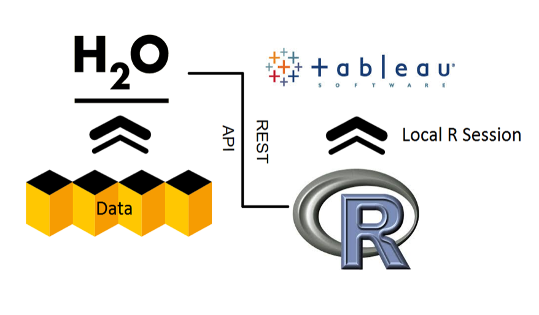

# Tableau Demos

The following github repository is used to store example Tableau workbooks that utilizes H2O as the big data statistical component. The workbooks will use data that must be accessed externally. The focus of the Tableau workbooks available here are unique in that it utilizes H2O to add a machine learning component to Tableau.

## Prerequisites



Each of the demos have calculated fields that executes R code on a local R server session and because H2O has a R package you can call H2O from the Tableau calculated field. To set up the local R socket server as well as load H2O functionalities there are a few prerequisites that the user will need to first need to satisfy:

- [Java 7 + ](http://www.oracle.com/technetwork/java/javase/downloads/jdk7-downloads-1880260.html) - This is required to launch a H2O-3 instance
- [H2O R Package](http://h2o-release.s3.amazonaws.com/h2o/latest_stable.html) - To install from cran run:
```
install.packages("h2o")
``` 

- [Rserve R package](https://cran.r-project.org/web/packages/Rserve/index.html) - To install from cran run:
```
install.packages("Rserve")
```
- [Tableau 9.1+](http://tableau.com)


## List of Demos
1. [Lending Club Application](demos/lending_club/README.md)
2. [Airlines Dashboard](demos/airlines/README.md)
